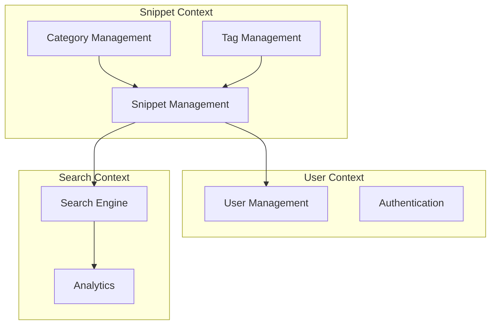

# 웹 개발 완전 훈련 계획서
## 코드 스니펫 관리자 with Domain Driven Design

---

## 📋 프로젝트 개요

### 목표
**전문적인 웹 개발 역량 습득**을 위한 체계적 훈련 프로그램으로, 코드 스니펫 관리자를 통해 DDD 아키텍처부터 배포까지 전체 개발 생명주기를 경험합니다.

### 핵심 학습 목표
- Domain Driven Design 실전 적용
- 체계적인 아키텍처 설계
- 문서 주도 개발 (Documentation Driven Development)
- gemini cli를 활용한 AI 협업 개발
- 전문적인 테스트 전략
- 현대적인 배포 파이프라인

---

## 🎯 프로젝트 정의: CodeVault

### 비전 스테이트먼트
"개발자가 코드 지식을 체계적으로 축적하고 효율적으로 재사용할 수 있는 지능형 코드 스니펫 관리 플랫폼"

### 핵심 가치 제안
1. **지능형 분류**: AI 기반 자동 태깅 및 카테고리 분류
2. **빠른 검색**: 내용, 언어, 태그 기반 전문 검색
3. **컨텍스트 보존**: 스니펫의 사용 맥락과 의도 기록
4. **협업 지원**: 팀 내 코드 지식 공유 및 리뷰

---

## 🏗️ Domain Driven Design 아키텍처

### 도메인 식별

#### 핵심 도메인 (Core Domain)
```
Snippet Management
├── Snippet Aggregate
├── Category Aggregate  
└── Tag Aggregate
```

#### 지원 도메인 (Supporting Domain)
```
User Management
├── User Aggregate
├── Authentication
└── Authorization

Search & Discovery
├── Search Engine
├── Recommendation
└── Analytics
```

#### 일반 도메인 (Generic Domain)
```
Infrastructure
├── File Storage
├── Database
├── Caching
└── Monitoring
```

### Bounded Context 매핑



### 도메인 모델 설계

#### Snippet Aggregate
```typescript
// 도메인 엔티티
class Snippet {
  private constructor(
    public readonly id: SnippetId,
    public title: SnippetTitle,
    public content: SnippetContent,
    public language: ProgrammingLanguage,
    public tags: TagCollection,
    public category: CategoryId,
    public author: UserId,
    private metadata: SnippetMetadata
  ) {}

  public static create(
    title: string,
    content: string,
    language: string,
    authorId: string
  ): Result<Snippet, DomainError> {
    // 비즈니스 룰 검증
    // 팩토리 메서드 구현
  }

  public updateContent(newContent: string): Result<void, DomainError> {
    // 비즈니스 룰: 컨텐츠 업데이트 정책
  }

  public addTag(tag: Tag): Result<void, DomainError> {
    // 비즈니스 룰: 태그 추가 정책
  }
}

// 값 객체
class SnippetContent {
  constructor(
    private readonly value: string,
    private readonly checksum: string
  ) {
    this.validate();
  }

  private validate(): void {
    if (this.value.length > 10000) {
      throw new DomainError("Snippet content too long");
    }
    if (this.value.trim().length === 0) {
      throw new DomainError("Snippet content cannot be empty");
    }
  }
}

// 도메인 서비스
class SnippetDuplicationService {
  checkForDuplicates(
    content: SnippetContent,
    repository: SnippetRepository
  ): Promise<boolean> {
    // 중복 검사 로직
  }
}
```

---

## 🛠️ 기술 스택 설계

### 백엔드 아키텍처
```
표현 계층 (Presentation)
├── REST API (Express.js/TypeScript)
├── GraphQL API (Apollo Server)
└── WebSocket (실시간 기능)

응용 계층 (Application)  
├── Use Cases (Clean Architecture)
├── Command/Query Handlers
└── Application Services

도메인 계층 (Domain)
├── Entities & Value Objects
├── Domain Services
├── Repository Interfaces
└── Domain Events

인프라 계층 (Infrastructure)
├── PostgreSQL (Repository 구현)
├── Redis (Caching)
├── Elasticsearch (검색)
└── S3 (파일 저장)
```

### 프론트엔드 아키텍처
```
React 18 + TypeScript
├── 상태 관리: Zustand
├── 스타일링: Tailwind CSS
├── 라우팅: React Router v6
├── 폼 관리: React Hook Form + Zod
└── HTTP 클라이언트: TanStack Query
```

### DevOps & 도구
```
개발 도구
├── gemini cli (AI 협업)
├── ESLint + Prettier
├── Husky (Git Hooks)
└── Conventional Commits

테스트
├── Unit: Jest + Testing Library
├── Integration: Supertest
├── E2E: Playwright
└── API: Postman/Insomnia

배포
├── 컨테이너: Docker + Docker Compose
├── CI/CD: GitHub Actions
├── 인프라: Vercel (Frontend) + Railway (Backend)
└── 모니터링: Sentry + LogRocket
```

---

## 📚 문서화 전략

### 문서 구조
```
docs/
├── architecture/
│   ├── domain-model.md
│   ├── system-context.md
│   └── api-design.md
├── development/
│   ├── setup-guide.md
│   ├── coding-standards.md
│   └── gemini-guidelines.md
├── testing/
│   ├── test-strategy.md
│   └── test-scenarios.md
└── deployment/
    ├── deployment-guide.md
    └── monitoring.md
```

### 문서 작성 원칙
1. **Living Documentation**: 코드와 함께 업데이트
2. **Architecture Decision Records (ADR)**: 중요 결정사항 기록
3. **API First**: API 설계 우선, 문서화 필수
4. **Test Scenarios**: 모든 기능의 테스트 시나리오 문서화

---

## 🤖 gemini cli 협업 지침

### gemini.md 파일 구성
```markdown
# CodeVault 프로젝트 - gemini cli 지침

## 프로젝트 컨텍스트
- 도메인: 코드 스니펫 관리 시스템
- 아키텍처: Domain Driven Design + Clean Architecture
- 기술 스택: Node.js + TypeScript + React + PostgreSQL

## 코딩 표준
### TypeScript 룰
- 모든 함수는 반환 타입 명시
- 도메인 에러는 Result<T, Error> 패턴 사용
- 비즈니스 로직은 도메인 계층에만 위치

### 네이밍 컨벤션
- 도메인 엔티티: PascalCase (예: Snippet, Category)
- 값 객체: PascalCase + 의도 명시 (예: SnippetTitle, UserId)
- 도메인 서비스: ~Service suffix (예: SnippetDuplicationService)
- Repository: I~Repository interface + ~Repository implementation

### 파일 구조 룰
- /src/domain: 순수 도메인 로직만
- /src/application: 유즈케이스 및 애플리케이션 서비스
- /src/infrastructure: 외부 의존성 구현
- /src/presentation: API 엔드포인트 및 컨트롤러

## 개발 워크플로우
1. 도메인 모델 먼저 설계
2. 테스트 케이스 작성
3. 구현
4. 리팩토링

## 금지사항
- 도메인 계층에서 인프라 의존성 참조 금지
- 비즈니스 로직을 컨트롤러에 작성 금지
- any 타입 사용 금지
- console.log 사용 금지 (구조화된 로깅 사용)
```

### gemini cli 프롬프트 템플릿
```
### 기능 개발 템플릿
"[도메인명]에서 [기능명] 기능을 DDD 패턴으로 구현해줘.
요구사항: [구체적 요구사항]
비즈니스 룰: [비즈니스 제약사항]
테스트 케이스도 함께 작성해줘."

### 리팩토링 템플릭
"이 코드를 Clean Architecture 원칙에 맞게 리팩토링해줘.
현재 문제점: [문제점 설명]
목표: [리팩토링 목표]"

### 코드 리뷰 템플릿
"이 코드가 DDD 원칙을 잘 따르고 있는지 검토해줘.
특히 [검토 포인트] 부분을 중점적으로 봐줘."
```

---

## 📅 단계별 개발 계획

### Phase 1: 기반 구축 (1-2주)
**Week 1: 프로젝트 설정 & 도메인 모델링**
```
Day 1-2: 프로젝트 초기화
- 개발 환경 설정
- 기본 폴더 구조 생성
- gemini cli 지침 설정
- Git 워크플로우 구성

Day 3-5: 도메인 모델링
- Snippet Aggregate 설계
- Category & Tag 모델 설계
- 도메인 서비스 식별
- 비즈니스 룰 정의

Day 6-7: 인프라 기초
- 데이터베이스 스키마 설계
- Repository 인터페이스 정의
- 기본 엔티티 구현
```

**Week 2: 핵심 도메인 구현**
```
Day 8-10: Snippet Aggregate 구현
- Snippet 엔티티 구현
- Value Objects 구현
- 도메인 서비스 구현
- 단위 테스트 작성

Day 11-12: Repository 구현
- PostgreSQL Repository 구현
- 데이터 매핑 구현
- 통합 테스트 작성

Day 13-14: 애플리케이션 서비스
- 스니펫 생성 유즈케이스
- 스니펫 조회 유즈케이스
- 애플리케이션 테스트
```

### Phase 2: 핵심 기능 개발 (2-3주)
**Week 3: API 개발**
```
Day 15-17: REST API 구현
- 스니펫 CRUD API
- 카테고리 관리 API
- 태그 관리 API
- API 문서 자동 생성

Day 18-19: 검색 기능
- Elasticsearch 연동
- 검색 API 구현
- 자동완성 기능

Day 20-21: 사용자 관리
- 인증/인가 구현
- 사용자별 스니펫 관리
- 권한 관리
```

**Week 4-5: 프론트엔드 개발**
```
Day 22-24: 기본 UI 구현
- 라우팅 설정
- 레이아웃 컴포넌트
- 스니펫 목록 뷰
- Dark 테마 적용

Day 25-28: 상세 기능 구현
- 스니펫 에디터 (Monaco Editor)
- 코드 하이라이팅
- 태그 입력 컴포넌트
- 검색 인터페이스

Day 29-35: 고급 기능
- 드래그 앤 드롭
- 키보드 단축키
- 실시간 미리보기
- 반응형 디자인
```

### Phase 3: 고급 기능 & 최적화 (1-2주)
**Week 6: 고급 기능**
```
Day 36-38: AI 기능
- 스니펫 자동 태깅
- 유사 스니펫 추천
- 코드 품질 분석

Day 39-42: 협업 기능
- 스니펫 공유
- 팀 관리
- 댓글 시스템
- 즐겨찾기
```

### Phase 4: 테스트 & 품질 보증 (1주)
**Week 7: 종합 테스트**
```
Day 43-45: 테스트 완성
- E2E 테스트 시나리오
- 성능 테스트
- 보안 테스트
- 접근성 테스트

Day 46-49: 품질 개선
- 코드 리뷰
- 성능 최적화
- 버그 수정
- 문서 업데이트
```

### Phase 5: 배포 & 모니터링 (3-5일)
**배포 준비**
```
Day 50-52: 배포 구성
- Docker 이미지 최적화
- CI/CD 파이프라인 구성
- 환경별 설정 관리
- 보안 설정

Day 53-54: 프로덕션 배포
- 스테이징 환경 배포
- 프로덕션 배포
- 모니터링 설정
- 알람 구성
```

---

## 🧪 테스트 전략

### 테스트 피라미드
```
E2E Tests (10%)
├── 주요 사용자 플로우
├── 크리티컬 비즈니스 시나리오
└── 크로스 브라우저 테스트

Integration Tests (20%)
├── API 엔드포인트 테스트
├── 데이터베이스 통합 테스트
└── 외부 서비스 연동 테스트

Unit Tests (70%)
├── 도메인 엔티티 테스트
├── 도메인 서비스 테스트
├── 애플리케이션 서비스 테스트
└── 유틸리티 함수 테스트
```

### 테스트 시나리오

#### 도메인 테스트
```typescript
describe('Snippet Entity', () => {
  describe('생성', () => {
    it('올바른 데이터로 스니펫을 생성할 수 있다', () => {
      // Given: 올바른 스니펫 데이터
      // When: 스니펫 생성
      // Then: 성공적으로 생성됨
    });

    it('빈 제목으로는 스니펫을 생성할 수 없다', () => {
      // Given: 빈 제목
      // When: 스니펫 생성 시도
      // Then: 도메인 에러 발생
    });
  });

  describe('수정', () => {
    it('스니펫 내용을 수정할 수 있다', () => {
      // Given: 기존 스니펫
      // When: 내용 수정
      // Then: 수정됨, 메타데이터 업데이트
    });
  });
});
```

#### API 테스트
```typescript
describe('Snippets API', () => {
  describe('POST /snippets', () => {
    it('새 스니펫을 생성한다', async () => {
      // Given: 유효한 스니펫 데이터
      // When: POST 요청
      // Then: 201 상태코드, 생성된 스니펫 반환
    });

    it('잘못된 데이터로는 스니펫을 생성할 수 없다', async () => {
      // Given: 잘못된 데이터
      // When: POST 요청
      // Then: 400 상태코드, 에러 메시지
    });
  });
});
```

#### E2E 테스트
```typescript
test('스니펫 생성부터 검색까지 전체 플로우', async ({ page }) => {
  // 1. 로그인
  await page.goto('/login');
  await page.fill('[data-testid=email]', 'test@example.com');
  await page.fill('[data-testid=password]', 'password');
  await page.click('[data-testid=login-button]');

  // 2. 스니펫 생성
  await page.click('[data-testid=create-snippet]');
  await page.fill('[data-testid=title]', 'Test Snippet');
  await page.fill('[data-testid=content]', 'console.log("test");');
  await page.selectOption('[data-testid=language]', 'javascript');
  await page.click('[data-testid=save-button]');

  // 3. 검색으로 확인
  await page.fill('[data-testid=search]', 'Test Snippet');
  await expect(page.locator('[data-testid=snippet-item]')).toBeVisible();
});
```

---

## 🚀 배포 전략

### 컨테이너화
```dockerfile
# Dockerfile.backend
FROM node:18-alpine AS builder
WORKDIR /app
COPY package*.json ./
RUN npm ci --only=production

FROM node:18-alpine AS runtime
WORKDIR /app
COPY --from=builder /app/node_modules ./node_modules
COPY dist ./dist
EXPOSE 3000
CMD ["node", "dist/main.js"]
```

### Docker Compose 개발 환경
```yaml
version: '3.8'
services:
  app:
    build: .
    ports:
      - "3000:3000"
    environment:
      - NODE_ENV=development
      - DATABASE_URL=postgresql://user:pass@db:5432/codevault
    depends_on:
      - db
      - redis
      - elasticsearch

  db:
    image: postgres:15
    environment:
      POSTGRES_DB: codevault
      POSTGRES_USER: user
      POSTGRES_PASSWORD: pass
    volumes:
      - postgres_data:/var/lib/postgresql/data

  redis:
    image: redis:7-alpine
    
  elasticsearch:
    image: elasticsearch:8.8.0
    environment:
      - discovery.type=single-node
      - xpack.security.enabled=false
```

### CI/CD 파이프라인
```yaml
# .github/workflows/ci-cd.yml
name: CI/CD Pipeline

on:
  push:
    branches: [main, develop]
  pull_request:
    branches: [main]

jobs:
  test:
    runs-on: ubuntu-latest
    steps:
      - uses: actions/checkout@v4
      
      - name: Setup Node.js
        uses: actions/setup-node@v4
        with:
          node-version: '18'
          cache: 'npm'
          
      - name: Install dependencies
        run: npm ci
        
      - name: Run linting
        run: npm run lint
        
      - name: Run unit tests
        run: npm run test:unit
        
      - name: Run integration tests
        run: npm run test:integration
        
      - name: Run E2E tests
        run: npm run test:e2e

  build:
    needs: test
    runs-on: ubuntu-latest
    if: github.ref == 'refs/heads/main'
    steps:
      - uses: actions/checkout@v4
      
      - name: Build Docker image
        run: docker build -t codevault:${{ github.sha }} .
        
      - name: Push to registry
        run: |
          docker tag codevault:${{ github.sha }} registry.com/codevault:latest
          docker push registry.com/codevault:latest

  deploy:
    needs: build
    runs-on: ubuntu-latest
    if: github.ref == 'refs/heads/main'
    steps:
      - name: Deploy to staging
        run: |
          # 스테이징 배포 스크립트
          
      - name: Run smoke tests
        run: |
          # 기본 동작 확인
          
      - name: Deploy to production
        if: success()
        run: |
          # 프로덕션 배포 스크립트
```

---

## 📊 모니터링 & 품질 관리

### 애플리케이션 메트릭
```typescript
// 비즈니스 메트릭
- 스니펫 생성 수 (일/주/월)
- 검색 쿼리 수 및 결과 품질
- 사용자 활동 패턴
- 가장 인기 있는 언어/태그

// 기술 메트릭  
- API 응답 시간
- 데이터베이스 쿼리 성능
- 에러율 및 에러 타입
- 메모리/CPU 사용률
```

### 알람 설정
```yaml
alerts:
  - name: High Error Rate
    condition: error_rate > 5%
    duration: 5m
    
  - name: Slow API Response
    condition: response_time_p95 > 2s
    duration: 10m
    
  - name: Database Connection Issues
    condition: db_connection_errors > 0
    duration: 1m
```

### 로깅 전략
```typescript
// 구조화된 로깅
logger.info('Snippet created', {
  userId: user.id,
  snippetId: snippet.id,
  language: snippet.language,
  tags: snippet.tags.map(t => t.name),
  timestamp: new Date().toISOString(),
  correlationId: request.correlationId
});

// 보안 이벤트 로깅
logger.security('Authentication failed', {
  email: attempt.email,
  ip: request.ip,
  userAgent: request.userAgent,
  timestamp: new Date().toISOString()
});
```

---

## 🎯 성공 지표 & 학습 목표

### 기술적 목표
- [ ] DDD 패턴으로 복잡한 도메인 모델링
- [ ] Clean Architecture 구현
- [ ] 90% 이상 테스트 커버리지
- [ ] API 응답 시간 < 200ms (P95)
- [ ] 제로 다운타임 배포

### 학습 목표
- [ ] 도메인 전문가와의 유비쿼터스 언어 구축
- [ ] 이벤트 소싱 패턴 이해
- [ ] CQRS 패턴 적용
- [ ] 마이크로서비스 아키텍처 준비
- [ ] 클라우드 네이티브 애플리케이션 개발

### 포트폴리오 가치
- [ ] 실무 수준의 아키텍처 설계 역량 증명
- [ ] AI 도구를 활용한 현대적 개발 워크플로우
- [ ] 완전한 DevOps 파이프라인 경험
- [ ] 오픈소스 기여 가능한 품질의 코드베이스

---

## 📚 추천 학습 자료

### 도서
- "도메인 주도 설계" - 에릭 에반스
- "클린 아키텍처" - 로버트 C. 마틴
- "마이크로서비스 패턴" - 크리스 리처드슨

### 온라인 자료
- DDD Community 온라인 자료
- Clean Architecture 예제 프로젝트
- TypeScript 공식 문서

### 실습 프로젝트
- Event Storming 워크샵
- Legacy Code 리팩토링 연습
- 마이크로서비스 전환 시나리오

---

*이 계획서는 8-10주간의 집중적인 학습을 통해 전문적인 웹 개발 역량을 구축하기 위한 로드맵입니다. gemini cli와의 협업을 통해 현대적인 AI 기반 개발 워크플로우를 경험하면서, 동시에 탄탄한 아키텍처 설계 역량을 기를 수 있습니다.*